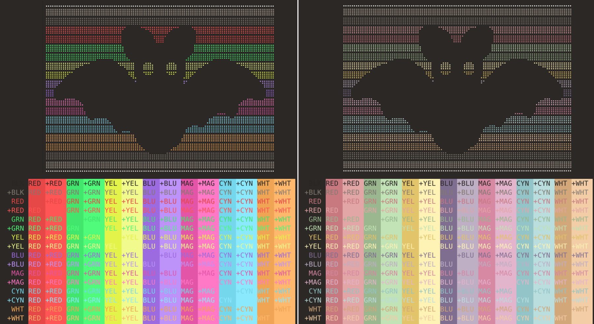

# Chocula Konsole Terminal Themes
Dark brown themes with [Dracula palette](https://github.com/dracula/konsole) or pastel accent colors for [Konsole](https://konsole.kde.org/)

## Installation
Download and extract the [zip file](https://github.com/SueDonham/chocula-konsole-themes/archive/refs/heads/main.zip) or run `git clone https://github.com/SueDonham/chocula-konsole-themes.git` in a terminal.

### Manual installation
Copy the .colorscheme file(s) of the desired theme(s) to `~/.local/share/konsole` and apply via Konsole's settings menu (Configure > Profiles > Edit > Appearance).

### Scripted installation
Open a terminal window in the cloned or extracted directory and run: `./install.sh`
- [install.sh](./install.sh) imports the desired theme(s) and offers to set it as the default.
- [remove.sh](./remove.sh) deletes all Chocula color schemes profiles and (if applicable) resets the default profile.

## License
[MIT](./LICENSE)
